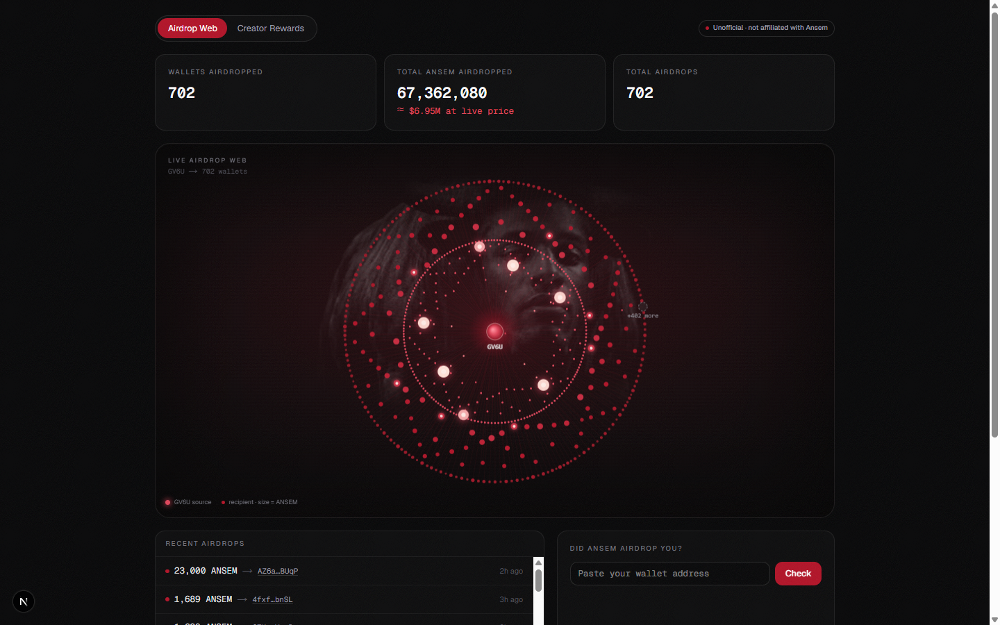
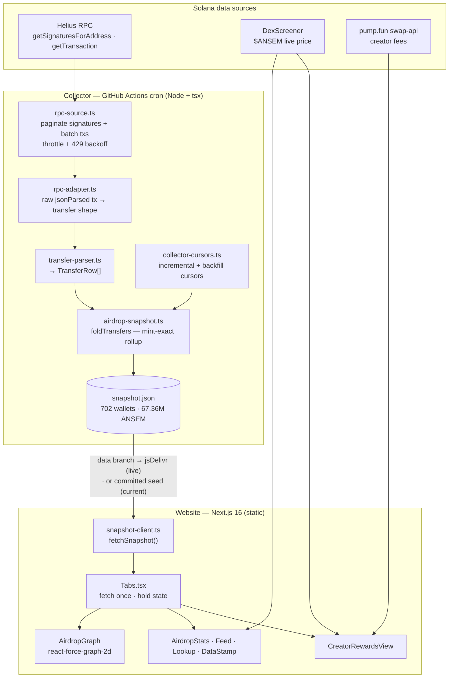

# did ansem drop? — Live $ANSEM Airdrop Map

> **[didansemdrop.me](https://didansemdrop.me)** — paste your wallet, see if you caught the drop.

An unofficial, **read-only** dashboard that maps every wallet Ansem
([@blknoiz06](https://x.com/blknoiz06)) airdropped **$ANSEM** to — straight from
on-chain data — plus a secondary view of his pump.fun creator rewards.

The hero is a cinematic force-graph of the airdrop: the source wallet
(`GV6U…dC52`) at the centre, every recipient radiating out, node size by amount
received. As of the committed snapshot that's **702 wallets · ~67.36M ANSEM ·
≈ $6.3M** at the live price (the full on-chain backfill — which corroborates
Ansem's stated ~$7M).

> **Unofficial.** Independent, read-only on-chain tracker. Not operated by,
> affiliated with, or endorsed by Ansem. Names/ticker/art identify the token only.



## Features

- **Airdrop web** — a 2D canvas force-graph (`react-force-graph-2d`): glowing GV6U
  core, oxblood flow particles streaming to recipient "embers" sized by ANSEM
  received, a "+N more" cluster for the long tail, and the Black Bull as brand
  atmosphere behind it.
- **Live feed** — the most recent airdrops (amount, recipient, time-ago, tx link).
- **Lifetime stats** — wallets airdropped · total ANSEM · total airdrops, with the
  USD value derived from the **live** price (never stored).
- **Recipient lookup** — paste any wallet → "did Ansem airdrop you?", with amount,
  dates, and tx link, or a clean miss.
- **Creator Rewards tab** — Ansem's pump.fun PumpSwap creator fees + the $ANSEM
  market panel (price / 24h / mcap / liquidity / volume).
- **Read-only by design** — no wallet connect, signing, swaps, or trading; the
  boundary is enforced in CI.

## Architecture (how it's built)



**Data flow in one line:** a scheduled Node collector reads GV6U's outgoing
transfers from Helius, parses the ANSEM ones (matched by *mint*, never symbol),
folds them into a compact `snapshot.json`, and a static Next.js site fetches that
snapshot and renders the graph, feed, stats, and lookup.

For a plain-language walkthrough, see **[docs/HOW-IT-WORKS.md](docs/HOW-IT-WORKS.md)**.

## Tech stack

| Layer | Choice |
|---|---|
| Framework | Next.js 16 (App Router, static) · React 19 · TypeScript |
| Styling | Tailwind v4 ("Black Noise" dark theme, oxblood `#B11226`) |
| Graph | `react-force-graph-2d` (HTML canvas) |
| Data | Helius RPC (standard `getSignaturesForAddress` / `getTransaction`) |
| Market | DexScreener ($ANSEM) · pump.fun swap-api (creator fees) |
| Collector | Node + `tsx`, run by GitHub Actions cron |
| Tests | `node:test` via `tsx` (real fixtures, no mocks) |
| Package manager | pnpm |

## Project structure

```
src/
  app/            page.tsx (server fetch) · layout · globals.css (theme + graph stage)
  components/     Tabs · AirdropWebView · AirdropGraph · AirdropStats · AirdropFeed
                  RecipientLookup · DataStamp · CreatorRewardsView · Unofficial
  lib/
    rpc-source.ts        Helius RPC: signature pagination + batched txs + backoff
    rpc-adapter.ts       raw jsonParsed tx → Helius transfer shape (pure)
    transfer-parser.ts   → TransferRow[] (pure)
    airdrop-snapshot.ts  AirdropSnapshot type + foldTransfers (mint-exact, pure)
    collector-cursors.ts incremental/backfill cursor math (pure)
    airdrop-view.ts      buildGraphModel · lookupRecipient · timeAgo (pure)
    snapshot-client.ts   fetchSnapshot() — CDN/seed read path
    price.ts · pump.ts   DexScreener + pump.fun (Creator Rewards tab)
    domain.ts            shared constants + types
scripts/
  collect-snapshot.ts    the collector (incremental + backfill + sync modes)
  capture-fixtures.ts    one-off: fetch real txs for tests
.github/workflows/
  collect.yml            scheduled collector → commits snapshot.json to `data` branch
public/snapshot.seed.json  committed snapshot served in seed-only mode
test/                    pure-function tests against real fixtures
docs/                    DEPLOY.md · HOW-IT-WORKS.md · design spec + plan
```

## Develop

```bash
pnpm install
pnpm dev            # http://localhost:3000
pnpm verify         # boundary check + lint + typecheck + tests + build (the gate)
```

Run the collector locally (needs a Helius key in `.env` as `HELIUS_API_KEY`):

```bash
# one bounded pass to a temp file (incremental new + backfill older)
node --env-file=.env --import tsx scripts/collect-snapshot.ts \
  --in public/snapshot.seed.json --out ./snap.tmp.json --mode sync --max 5000
```

## Deploy

Configured for **public + live data**: the site fetches the snapshot from the same-origin
path `/api/snapshot`, which `netlify.toml` rewrites server-side to jsDelivr (served off the
public repo's `data` branch, refreshed every 15 min by the collector cron) — so the GitHub
owner/repo stays out of the client bundle and network traces. It falls back to the committed
seed if the proxy/CDN is ever down. Open tabs re-poll
every 2 min. Full ordered checklist in **[docs/DEPLOY.md](docs/DEPLOY.md)** — make the
repo public, set the `HELIUS_API_KEY` Actions secret, seed the `data` branch, and
connect Netlify (deploy from `main`; the Linux build sidesteps the Windows EPERM
blocker). The site never calls Helius directly — only the CI collector does.

## Data integrity

- **Mint-exact:** a transfer counts only when `mint === 9cRCn9…pump`. ~12 decoy
  tokens are named "ANSEM"; symbol is never used.
- **Airdrops only:** the 0.002-SOL ATA-funding dust legs are overhead, not airdrops,
  and are excluded from the graph/stats/feed.
- **USD is live, never stored:** dollar figures = ANSEM amount × current price, shown
  with an "at live price" qualifier; they drift with the market.
- **Full backfill:** the committed snapshot has `backfillComplete: true` — it's the
  complete on-chain history of GV6U's ANSEM distributions, not a sample.

## Credits

On-chain data via [Helius](https://helius.dev). Market data via DexScreener and the
pump.fun swap-api. Not affiliated with Ansem, Helius, DexScreener, or pump.fun.
